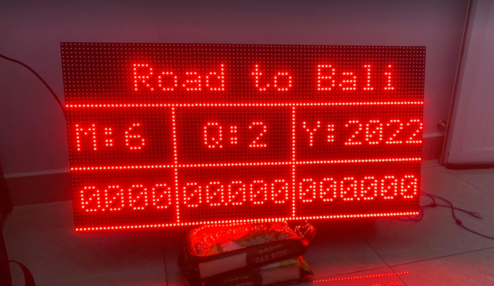

# INTRODUCE
Build a led matrix to display user requirements (title, month/quarter/year, revenue) and can set parameters on the web.
***
# HARDWARE 
#### List of main devices
- **Arduino Uno x2**: 1 Arduino to display/control the led panels to display the title and the other to display/control the month/quarter/year and revenue led panels.
- **ESP8266**: receive data from the user's web to edit the parameters and then display it on the led board.
#### Connection
- The connection between ESP and 2 Arduino is I2C

- The connection between  Arduino and Led Matrix P10

#### Result    

***
# SOFTWARE 
**Web UI**: use node-red to design web user interface.
[link code][1]

**Code Esp**: [link code][2]
- Install and adjust wifi connection.
- In the loop: get real time to be able to select the display mode of the led matrix panel (>= 8h && <= 20h => LED MATRIX ON).
- Process data when received from the user's web.

**Code Arduino Realtime (address in I2C: 8)**: [link code][3]
- Receive and process data.
- Display on (2x3) Led Matrix.

**Code Arduino Title    (address in I2C: 1)**: [link code][4]
- Receive and process data.
- Display on (1x3) Led Matrix.

**Database**: Google Sheets
***
# RESULT
#### Led Matrix

#### Web UI

[1]: <https://github.com/lhkhanh080720/Led_Matrtix/blob/main/Code/Code%20Node-Red.docx>
[2]: <https://github.com/lhkhanh080720/Led_Matrtix/blob/main/Code/esp8266wifi.ino>
[3]: <https://github.com/lhkhanh080720/Led_Matrtix/blob/main/Code/arduinorealtime.ino>
[4]: <https://github.com/lhkhanh080720/Led_Matrtix/blob/main/Code/arduinotieude.ino>

